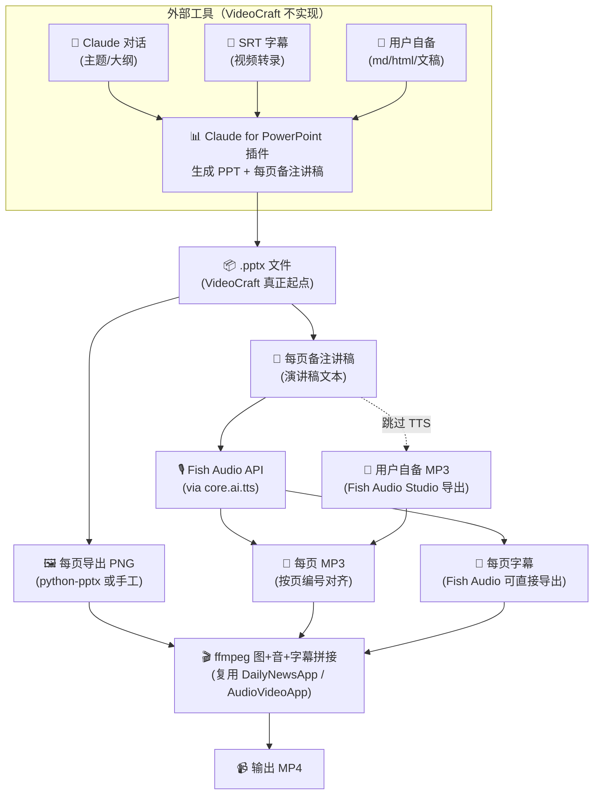

# PPT 视频生成管线

打通「内容主题 → PPT → 每页讲稿 → TTS → 图音合成 → MP4」全链路。核心发现：**Claude for PowerPoint 插件**（**外部工具**）的实际能力比原草稿预期强很多 — 直接喂 SRT 就能生成带备注讲稿的 PPT（已用 JD Vance 演讲实例验证）。VideoCraft 的边界是「输入 .pptx → 输出 .mp4」，PPT 本身的生成交给外部插件。

音频侧支持**两条并行路径**共存：API 自动合成（快，已集成）与用户自备 MP3（精修，走 Fish Audio Studio web 导出）。

**依赖**：本管线重度依赖 AI 能力（TTS、可选 ASR、翻译）。`core/ai` 统一门面已就位（详见 [docs/design/04-ai-router.md](../design/04-ai-router.md)）。

---

## 总览流程



---

## UI 形态：步骤清单（弱线性）

**已决策**：采用步骤清单式，不用强向导。

5 个步骤并列带状态圆点（idle / running / done / error），每步可独立点"运行此步"也可按顺序跑全流程。按钮区提供：「运行当前步骤」/「从此步开始到底」/「运行全部」。

**理由**：PPT2Video 流程虽然线性（上一步产物是下一步输入），但**高频需要重做某一步** — TTS 试听不满意重跑、换音频、字幕微调、重新合成。强向导（只能「下一步」推进）会把这些场景逼成"从头过一遍"，体验差。步骤清单是真正的"弱线性" — 默认顺序推进，但随时可以跳回某步单独重跑。

风格参考：[src/tools/video/split_workbench.py](../../src/tools/video/split_workbench.py) 的顶部载入 + 中部列表 + 底部操作栏三段式。

### 5 个步骤

| # | 步骤 | 输入 | 输出 | AI? |
|---|------|------|------|-----|
| 1 | 提交 PPT | （用户手动放入） | `<workdir>/source.pptx` | ❌ |
| 2 | 导出每页图 + 提取讲稿 | `source.pptx` | `pages/page_NN.png` + `notes/page_NN.txt` | ❌ |
| 3 | 生成每页音频 | `notes/page_NN.txt`（或用户自备 MP3） | `audio/page_NN.mp3` | ✅ (TTS) |
| 4 | 生成每页字幕 | 音频 / 讲稿 | `subs/page_NN.srt` | ✅ (Fish Audio 导出) |
| 5 | 合成 MP4 | 图 + 音 + 字幕 | `output.mp4` | ❌ |

第 1 步是**说明页**：工具不做 PPT 生成，只展示使用提示（如何用 Claude for PowerPoint 插件）+ 文件提交入口（拖入或选择 .pptx → 自动复制到工作目录）。

---

## 工作目录约定

**已决策**：依赖 Hub project folder。

- 工作台打开时检查 `self.project is None`，空就显示"请先 File → Open Folder"引导页（见下一节「待建共用组件」）
- 有 project：工作台默认在 `<project>/ppt2video/` 下建子目录组织所有中间产物
- 子目录结构：
  ```
  <project>/
    └── ppt2video/
        ├── source.pptx           # 用户提交的 PPT
        ├── pages/
        │   ├── page_01.png
        │   └── page_02.png
        ├── notes/
        │   ├── page_01.txt
        │   └── page_02.txt
        ├── audio/
        │   ├── page_01.mp3       # API 合成 or 用户放入
        │   └── page_02.mp3
        ├── subs/
        │   ├── page_01.srt
        │   └── page_02.srt
        └── output.mp4            # 最终成品
  ```

**命名规则**：`page_NN`（01 起、两位数补零）— 与 Fish Audio Studio 的诡异命名对齐由独立映射层处理（见「待决策」#4）。

---

## 待建共用组件

### `EmptyStateFrame`（空 project 引导页）

多产物工作流工具共用：PPT2Video、[split_workbench](../../src/tools/video/split_workbench.py)、未来的 subtitle_workbench（见 [docs/draft/SubtitleWorkbench.md](SubtitleWorkbench.md)）。

行为：当 `self.project is None`，工作台不显示正常 UI，而是渲染一个引导页：
- 中央大字提示："请先打开工作目录"
- 下方按钮："File → Open Folder"（直接触发 Hub 的 open_folder 流程）
- （可选）近期项目快捷入口

**不强制全局要求 project** — 单文件工具（字幕翻译 / 烧录 / 音量调整等）保持 project 可选，有 file picker 就能独立工作。

**建议位置**：`src/ui/empty_state.py` 或 `src/tools/base.py` 增补 `require_project()` 辅助方法。

---

## 分节详述

### 1. PPT 来源（Claude for PowerPoint 插件）

**三种入口可任选**，全部在 VideoCraft 外部完成：

| 入口 | 适用场景 |
|---|---|
| 💬 Claude 对话（主题/大纲） | 从零构思节目；Claude 生成结构化 slide + 备注 |
| 📄 SRT 字幕 | 已有视频素材（访谈/演讲/讲座转录）想二次加工 |
| 📝 用户自备文稿（md/html） | 已有写好的讲稿，只需视觉化 |

PPT 产物包含两类信息：
- **幻灯片本身** → 每页导出为 PNG，作为视频画面
- **每页备注（notes slide）** → TTS 讲稿 + 字幕文本源

### 2. 视频素材（第二步：每页图）

- 导出方式待选型（见「待决策」#1）
- 命名 `page_01.png`, `page_02.png`, …
- python-pptx 本身不能渲染，只能读结构，导出 PNG 需外部工具

### 3. 音频素材（第三步：每页讲稿转语音）

讲稿来源：PPT 每页备注（通过 python-pptx 读 `slide.notes_slide.notes_text_frame.text`）。

**两条并行支路**：

#### a. 用户自备 MP3（走 Fish Audio Studio web）

场景：精修发音、多次试听、重要发布。用户在 Fish Audio Studio 网页端逐段生成并下载 MP3，放入 `<workdir>/audio/`。

⚠️ **已知问题**：Fish Audio Studio 导出的文件命名诡异 — 第 1 个是 `0-1.mp3`、第 9 个是 `8-9.mp3`。需要做命名映射（见「待决策」#4）。

#### b. API 自动合成

场景：一次成型、批量、迭代快。走 `core.tts.synthesize_text(...)` feature 层 → `ai.tts(...)` 门面（详见 [docs/design/04-ai-router.md](../design/04-ai-router.md)）。

### 4. 图 + 音 → 视频（第四步：合成）

**按页编号对齐**：`page_N.png` + `page_N.mp3` → `page_N.mp4` 段，最终 ffmpeg concat 成单一 MP4。每段时长由该页音频时长决定（音画同步）。

**已有可复用代码**：

| 能力 | 位置 |
|---|---|
| ffmpeg filter 链（scale / pad / overlay / drawtext） | [text2video.py:1669-1691](../../src/tools/text2video/text2video.py#L1669) DailyNewsApp |
| 多章节（图+音+字幕）合成 | [text2video.py:923](../../src/tools/text2video/text2video.py#L923) AudioVideoApp `_generate()` |
| 多段视频合并 | [core/video_concat.py:39](../../src/core/video_concat.py#L39) `concat_videos()` |

### 5. 字幕处理（第五步）

**新发现**：Fish Audio **可直接导出字幕**（格式/精度待验证，见「待决策」#5）。若可用则省去 SRTFromTextApp 的"字符比例推时轴"近似。

两条路径并存：
- **优先**：Fish Audio 导出字幕 → 直接烧录 / 外挂
- **回退**：[text2video.py:352](../../src/tools/text2video/text2video.py#L352) SRTFromTextApp 字符比例推算

---

## 待决策

1. **PNG 导出工具链**：LibreOffice headless（跨平台免费）/ Microsoft PowerPoint COM（仅 Windows 已装 Office）/ 云 API（Aspose 等付费）三选一
2. **Edge TTS 分支**：原草稿写了"免费档 Edge TTS + 发布档 Fish Audio"双档。代码里只有 Fish Audio。保留 Edge TTS 作为免 key 备选（走 core.ai.tts 的 economy 档）还是单一 Fish Audio 路线？
3. **工作目录命名**：固定 `<project>/ppt2video/` 还是带时间戳 `ppt2video_20260416_1530/`？前者简单但多次生成会覆盖；后者稳健但要列表管理
4. **Fish Audio Studio 命名映射辅助工具**：是否做「指定目录 + 奇怪命名规则 → 自动配对每页」的小工具？（前提是先搞清楚 `0-1.mp3` / `8-9.mp3` 的真实规律）
5. **Fish Audio 字幕导出格式**：SRT / JSON / 其他？时间戳精度（ms / 按词 / 按句）？是否需 API 特殊参数？

---

## 可复用的项目现有能力

| 能力 | 位置 | 说明 |
|---|---|---|
| Fish Audio TTS（待迁入 core.ai） | [text2video.py:234](../../src/tools/text2video/text2video.py#L234) TTSApp | 单/多角色 |
| 多角色对话解析 | [text2video.py:308](../../src/tools/text2video/text2video.py#L308) `_parse_dialogue` | "角色名：台词" 格式 |
| 图+音+字幕 → MP4 | [text2video.py:1669-1703](../../src/tools/text2video/text2video.py#L1669) DailyNewsApp ffmpeg 链 | scale / pad / overlay / drawtext |
| 多章节合成 | [text2video.py:923](../../src/tools/text2video/text2video.py#L923) AudioVideoApp | 每章节独立音频+图+字幕 |
| 多段视频合并 | [core/video_concat.py:39](../../src/core/video_concat.py#L39) `concat_videos()` | ffmpeg concat demuxer |
| SRT 时轴（字符比例推算） | [text2video.py:352](../../src/tools/text2video/text2video.py#L352) SRTFromTextApp | 回退方案 |
| ToolBase / Tab 框架 | [tools/base.py](../../src/tools/base.py) + Hub TOOL_MAP | 新工具接入范式 |
| 步骤清单范式参考 | [split_workbench.py](../../src/tools/video/split_workbench.py) | 已决策的 UI 风格蓝本 |

---

## 关联 BACKLOG 项

- 本条：[BACKLOG.md:12](../../BACKLOG.md#L12) 🔴 P1「PPT 视频生成管线」
- **前置依赖**：core.ai 门面 + AI 控制台已就位 — 详见 [docs/design/04-ai-router.md](../design/04-ai-router.md)
- 已完成基础：Done「text2video TTS 重构（Fish Audio）」— 音频侧基础
