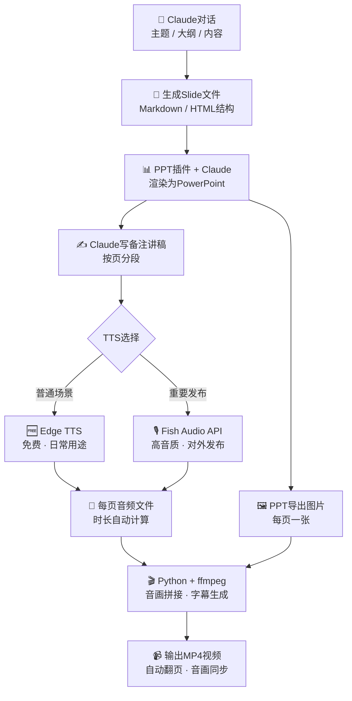

# PPT视频生成管线

## 各节点说明

| 节点 | 工具 | 备注 |
|------|------|------|
| Claude对话 | Claude.ai 网页版 | 生成内容大纲和Slide结构 |
| 生成Slide | Markdown / HTML | 结构化内容，便于插件解析 |
| PPT插件 + Claude | Claude for PowerPoint | 渲染成正式PPT文件 |
| 写备注讲稿 | Claude | 按页分段，控制每段时长 |
| Edge TTS | edge-tts Python库 | 免费，无需API key |
| Fish Audio API | Fish Audio | 高音质，适合对外发布 |
| PPT导出图片 | python-pptx | 每页导出为PNG |
| 音画拼接 | ffmpeg | 按音频时长控制每页停留时间 |
| 输出MP4 | ffmpeg | 含字幕，音画自动同步 |
